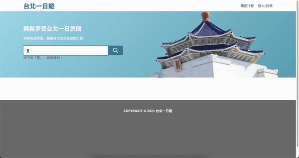

# Taipei Day Trip

Taipei Day Trip is an e-commerce website that offers travel bookings. This website provides members to search about tourist attractions, make reservations and make payments. Browse the site, hope you have a good time.

## Browse the site

[Taipei Day Trip](http://taipei-day-trip.chengtze.cc/)

-   Test User for Login
    -   Email: demo@email.com
    -   Password: demo
-   Test Credit Card for Payment
    -   Card Number: 4242-4242-4242-4242
    -   expiry date: 01/28
    -   ccv: 123

## Features

-   <h3>Booking & Payment System</h3>

    

-   <h3>Member System</h3>

    

-   <h3>Search</h3>

    

-   <h3>Lazy Loading</h3>

    

-   <h3>Image Carousel</h3>

    

## Technique

-   Powered by <b>Flask</b>
-   Following the <b>MVC pattern</b>, the website is divided into three parts:
    -   Model: the data layer, containing the database connection and operations.
    -   View: the presentation layer, containing the HTML templates and static files.
    -   Controller: the business logic layer, containing the api calls and the business logic.
-   Following the <b>Restful API</b> design.
-   Using <b>AWS RDS (MySQL)</b> for database, <b>EC2</b> for server.
-   Using <b>Docker</b> for containerization, <b>Docker Compose</b> for deployment.
-   Using <b>Gunicorn</b> for application server.
-   All front-end dynamics are built with <b>pure JavaScript</b>, without using any third-party packages.
-   Using <b>TapPay</b> for payment gateway.
